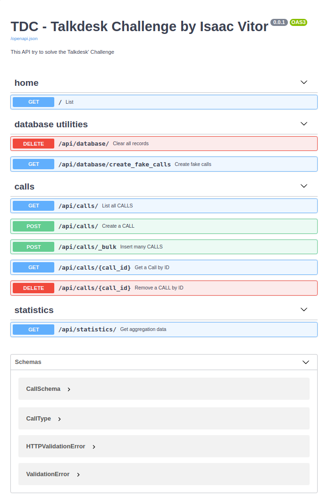

# TDC - Talkdesk Challenge by Isaac Vitor
---
## Goals
This application/repo aims to implement a service to manage a specific resource: Calls. The Call resource represents a phone call between two numbers with the following attributes:

* **Caller Number:** the phone number of the caller.
* **Callee Number:** the phone number of the callee.
* **Start Timestamp:** start timestamp of the call.
* **End Timestamp:** end timestamp of the call.
* **Type:** Inbound or Outbound

This challenge should have two components: a **Web Service** and a **Client**.

The **web service** should be able to do:

* Create Calls (one or more).
* Delete Call.
* Get all Calls using pagination and be able to filter by Type.
* Get statistics (the response to this operation should have the values aggregate by day, returning all days with calls):
    1. Total call duration by type.
    2. Total number of calls.
    3. Number of calls by Caller Number.
    4. Number of calls by Callee Number.
    5. Total call cost using the following rules:
    * Outbound calls cost 0.05 per minute after the first 5 minutes. The first 5 minutes cost 0.10.
    * Inbound calls are free.

The **client**: 

The Client should allow the programmer to use all the operations of the Web Service without having to handle the connection by himself.


In this way to achieve the goals, the solution proposed by me assume some aspects:

* **webservice**: is represented by API developed using [FastAPI](https://fastapi.tiangolo.com/) because a lot of reasons.

* **client**: is represented by **OpenAPI Docs** generated by FastAPI. This documentation actually is a dynamic way to test and see an API working. Despite I have frontend skills, creating a relevant frontend application involves a lot of time. So I concentrated effort on the backend solution.

* **caller**: I assumed that caller is a person that **makes** a call, then in an **inbound call** caller is a **company' client** but in an **outbound call** the caller is a **call center' agent**

* **callee**: I assumed that the callee is a person that **receives** a call, then in an **inbound call** callee is a **call center' agent** but in an **outbound call**  the callee is a **company' client**

*Really, to me, these two terms are a lite bit complicated to understand because I don't have all knowledge of the context.*

* **statistics**: To create an experience close to the "real world app" where you could to configure all system' parameters in a management control area, for instance, to simplify this idea I created a configuration file called **business_rules.json** into **config folder**  inside of project folder.
This configuration file has this structure:
    ```Json
    {
        "agents":{"max":10},
        "clients":{"max":100},
        "rates":{
            "inbound":{"fixed_rate":{"minutes":0, "price":0}, "variable_rate":{"minutes":0, "price":0} },
            "outbound":{"fixed_rate":{"minutes":5, "price":0.10}, "variable_rate":{"minutes":1, "price":0.05} }
        }
    }
    ```
    To improve the ***"statistics' test experience"***, I decided create an endpoint("/api/database/create_fake_calls") to generate a lot of "fake calls". The parameter **agents** represent the quantity of **agents' phone numbers** that will be created to be used in the **fake calls**.
    In the same way, the parameter **clients** represent the quantity of **clients' phone numbers**.
    Actually, these two parameters could be overridden by two **environment variables**: **TDC_MAX_AGENTS** and **TDC_MAX_CLIENTS**.<br>
    The **rates object** contains the base to calculate the cost of inbound and outbound calls.

    The **fixed_rate** represents a fixed cost applied a call, for example, in the **outbound calls** the first 5 minutes have a cost of 0.10. In this case the parameter **minutes** represents the time of this rule to be applied. In the same way, **price** represents the cost of this tax/rate.<br><br>

    The **variable_rate** have the same idea of **fixed_rate** but is applied accord to the rules of the challenged. **minutes** represents the unit base to calculate extra time and **price** represents the unitary value.<br><br>

    According to the challenge' rules, only **outbound calls** have a cost. Because of that by default only **outbound calls** values were set. 

## What was used to solve the challenge?

Was I said above I used [FastAPI](https://fastapi.tiangolo.com/) to be the solution basement. **FastAPI** is an amazing framework to create high-performance applications.

To persist the data I used a simple and effective solution, the **SQLite** database embedded in the API. Of course, I know that **SQLite** is not a good solution for a real and scalable application. My motivation to choose it was to keep the solution simple package in other words remove externals dependencies, keep all in a bundle.

There are many ways to treat the data architecture in this challenged, for example, using a relational database obviously, we need to create relationships between the objects around the call resource.

With this in mind, **caller** and **callee** entities were abstracted to a simples "phone number" parameter/column in the table Calls.

To manager data structures in the API side, I used the ORM called [peewee](http://docs.peewee-orm.com/en/latest/).

Basically to create the source code architecture I divided the project into three main packages: **Models**, **Controllers** and **Routers**
## How to run

#### Using Docker way

If you have Docker in your machine you just follow the steps below:

1. **Clone this repo** where do you prefer

2. **Inside of the repo, run the command below** to [create a docker](https://docs.docker.com/engine/reference/builder/) image of the project:
```Shell
$ docker build -t isaacvitor/tdc_back:latest .
```
*Be patient maybe take some time*

3. **After the build** run the command below to create a docker container:
```Shell
$ docker run -d --name tdc_back -p 8000:80 isaacvitor/tdc_back:latest
```

*After this point probably the container is running*

4. **Open your browser** and access the project by addresses:
    * http://127.0.0.1:8000 to see the simple home page implementation
    * http://127.0.0.1:8000/docs to see and test all endpoints of API

#### Using boring' way

To run the app in your machine you need to have python3 installed or a *virtual solution environment* such as anaconda or virtualenv.

1. **Clone this repo** where do you prefer
2. **Inside of the repo, run the command below**:
```
$ pip install --no-cache-dir -r requirements.txt
``` 
*Again, be patient maybe take some time*

3. If everything **happens successfully**, you could run the command below:

```
$ uvicorn main:app
``` 

4. **Open your browser** and access the project by addresses:
    * http://127.0.0.1:8000 to see the simple home page implementation
    * http://127.0.0.1:8000/docs to see and test all endpoints of API

## What you will see...

The image below shows how "client" looks like:

